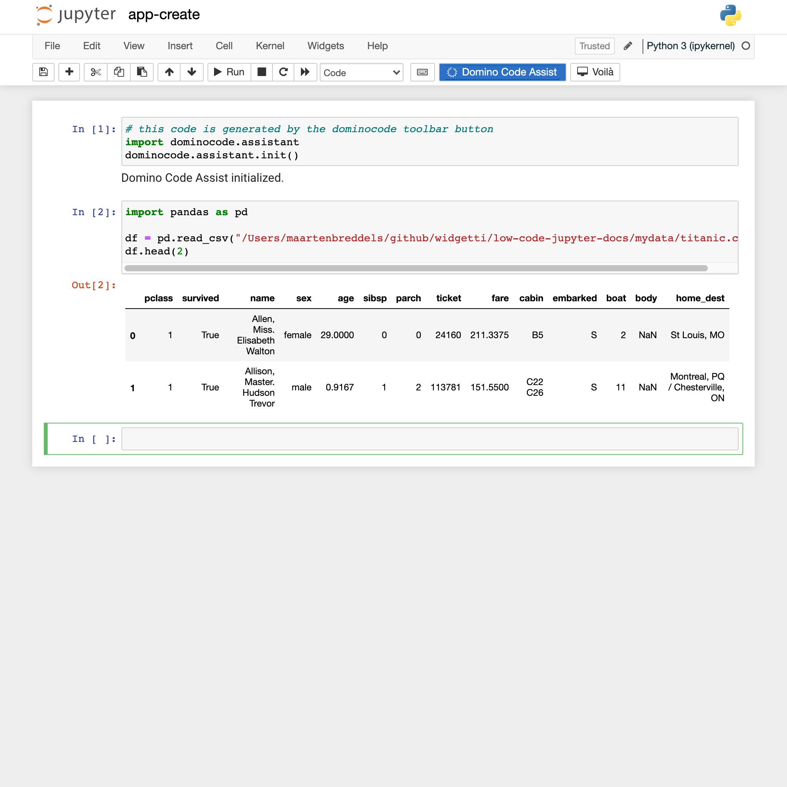
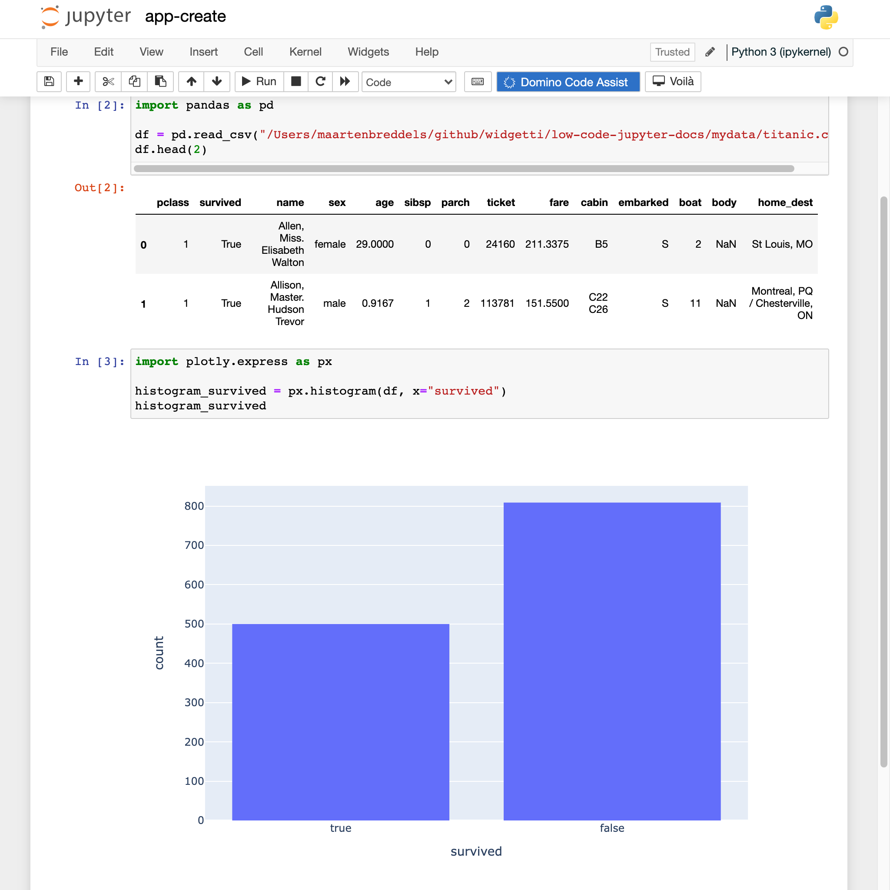
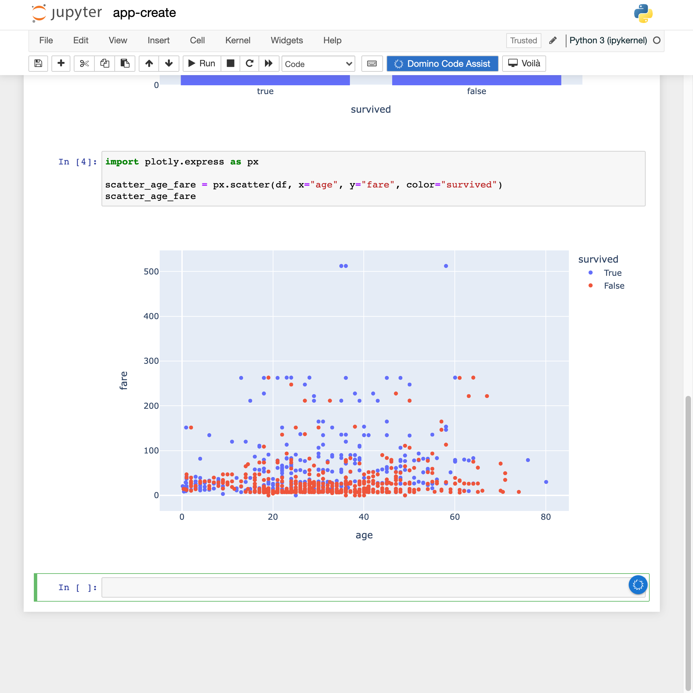
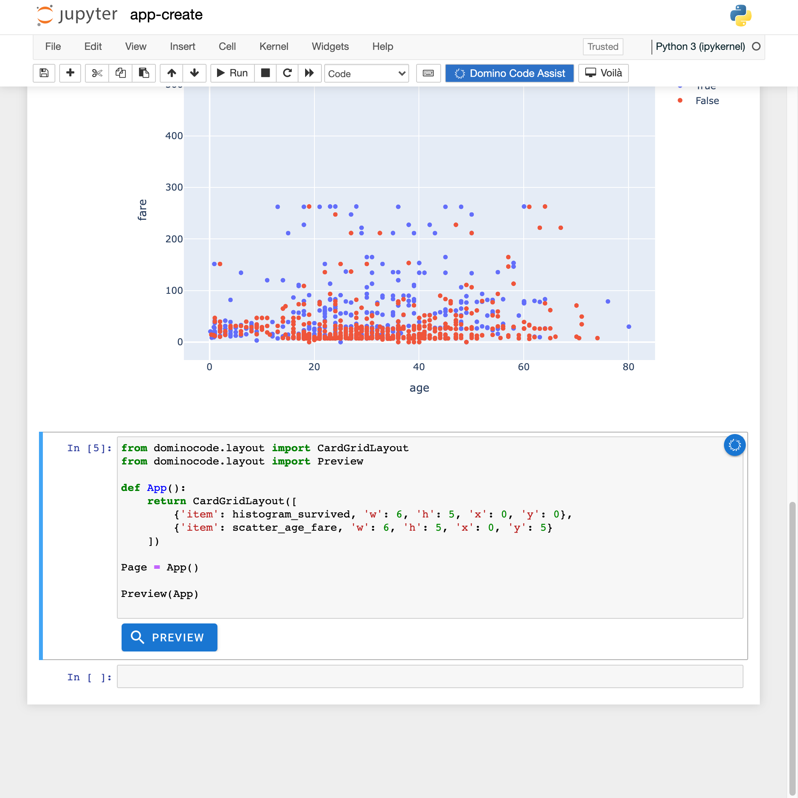

# Create an App


<video controls>
    <source src="https://user-images.githubusercontent.com/46192475/182823255-546f81a9-f485-4b54-9bee-b0dc851b4da5.mp4" type="video/mp4">
</video>


## Check installation

If you have followed the [installation instructions](../../install.md), you should see a blue <span style="background-color: #2D71C7; color: white; padding: 3px 10px 3px 10px">Low Code Assistant™</span> button in the toolbar of your Jupyter notebook.


## Initialize the Low Code Assistant™


The Low Code Assistant™ can be started by clicking the <span style="background-color: #2D71C7; color: white; padding: 3px 10px 3px 10px">Low Code Assistant™</span> button in the toolbar. It will insert a code snippet in a new code cell and execute it. After running succesfully, you should see `Low Code Assistant™ initialized`, as in the following screenshot:


<!-- If you now hover above a code cell, you should see a blue icon {.assistant-icon} to the right:


If you hover above the {.assistant-icon} icon, it will show a popup menu: -->

<!--  -->

## Loading CSV data into a Pandas DataFrame

Load a dataset using the Low Code Assistant™, as described in [Getting started](../../) or by adding your own code. In our example we add the following code ourselves:
```python
import pandas as pd
df = pd.read_csv("../mydata/titanic.csv")
df.head(2)
```



## Creating visualizations

### Adding a histogram

Create a histogram using the Low Code Assistant™, as described in [Scatter Plot](../viz/scatter.md) or adding your own code. In our example we add the following code ourselves:

```python
import plotly.express as px

histogram_survived = px.histogram(df, x="survived")
histogram_survived
```



!!! info "Last expression"

    Note that the last expression (`histogram_survived`) causes the visual to display in the Jupyter notebook.


### Adding a scatter plot

Create a scatter plot using the Low Code Assistant™, as described in [Scatter Plot](../viz/scatter.md). In our example we add the following code ourselves:

```python
import plotly.express as px

scatter_age_fare = px.scatter(df, x="age", y="fare", color="survived")
scatter_age_fare
```


!!! info "Last expression"

    Note that the last expression (`scatter_age_fare`) causes the visual to display in the Jupyter notebook.

## Open the App configurator

If you now hover above the next code cell, you should see a blue icon {.assistant-icon} to the right:



If you hover above the {.assistant-icon} icon, it will show a popup menu:


Click on the App button {.retina-image .docs-border} to open the app configurator.


## Configure the app

Toggle the visualization matching the variables found in the notebook to add them to the app.
Optionally drag and resize the apps.


## Insert the code

When ready, click 'Insert code'.



The configuration is added in code to your notebook. The code can be edited, and a preview can be shown
by clicking the {.retina-image} button.


