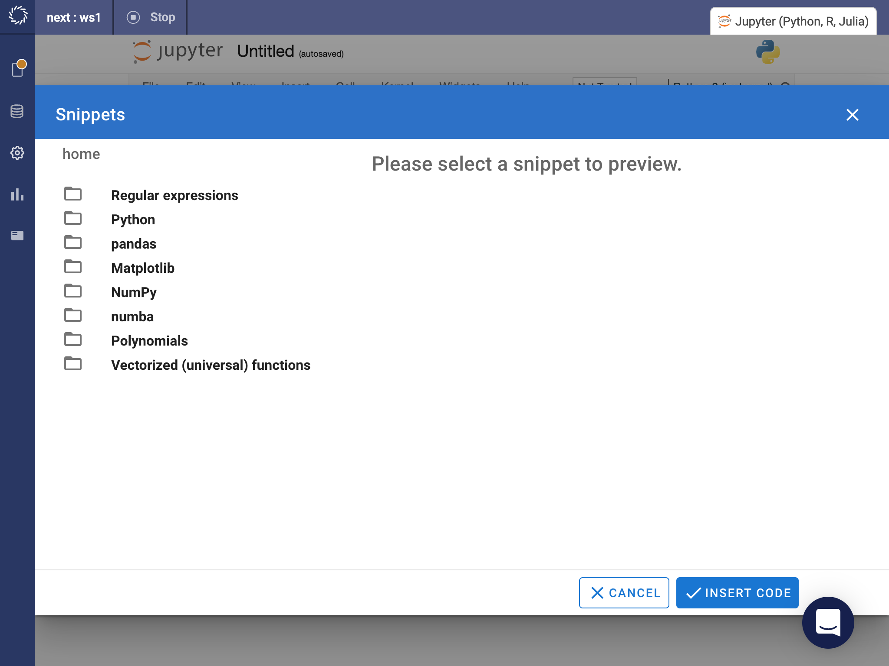
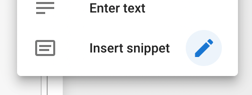
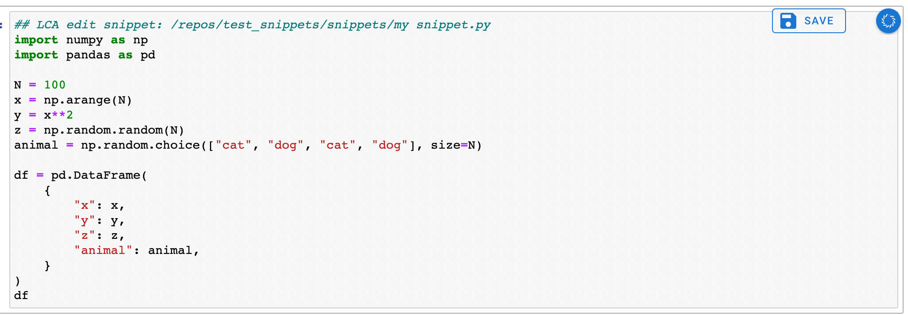

# Code Snippets

## Using snippets

Choose "Insert snippets" from the Low Code Assistant™ menu to insert code snippets into your notebook.

{: style="width: 299px"}

Browse the available snippets and select the one you want to insert.
{: style="width: 1024px"}
{: style="width: 1024px"}

## Adding snippets

A snippet library can be added by adding a git repository with snippets to your Domino project.
{: style="width: 1024px"}
An example snippet library can be found here: [https://github.com/dominodatalab/low-code-assistant-snippets](https://github.com/dominodatalab/low-code-assistant-snippets)

If credentials are required to access the repository, they can be setup in your account:

Select "Account Settings"

{: style="width: 347px"}

Select "Git Credentials"
{: style="width: 1024px"}

{: style="width: 1024px"}

## Snippet format

LCA looks for snippets in a "snippet" folder in the root of the repository. Any python files in this folder will be loaded as snippets.
The sub folder structure will be maintained in the LCA menu.

Example:
<pre>
MySnippets
 ├── .git
 ├── snippets
      ├── my_snippet.py
      ├── subfolder
           ├── my_other_snippet.py
</pre>

## Editing snippets

Snippets can be edited:

   - In the git repository with your regular git workflow for this repo.
   - In the notebook using LCA.
   - With VSCode by opening a workspace with VSCode for this project in Domino.

### Editing with LCA

Enable snippet edit mode by clicking the pen icon in the context menu:

{: style="width: 299px"}
{: style="width: 251px"}

Enter the snippet code and click on "SAVE AS SNIPPET"

{: style="width: 1024px"}

Enter the name of the snippet and select the repository to store the snippet

{: style="width: 413px"}

After this you can keep editing the snippet if needed and save by clicking "SAVE"

{: style="width: 1024px"}

After the enabling the snippet edit mode, controls for editing snippets are also displayed in the snippets panel.

{: style="width: 413px"}

To sync the snippet back to git, open "File Changes" in the left-hand sidebar and click "Select and sync"
on the "Imported Repositories" section

{: style="width: 588px"}

### Editing with a VSCode workspace

Click on  "Open Folder" in VSCode

{: style="width: 526px"}

Imported git repo's are available at "/repo"

{: style="width: 632px"}

Create a new snippet

{: style="width: 708px"}

Sync changes in the "Imported Repositories" section:

{: style="width: 593px"}

## Updating snippets in Notebook workspace

When snippets are updated in the git repository, the change is only visible in the notebook workspace after pulling the changes and reloading the snippets.

Click on "pull" in the "Imported Repositories" section

{: style="width: 430px"}

Reload snippets

{: style="width: 325px"}
