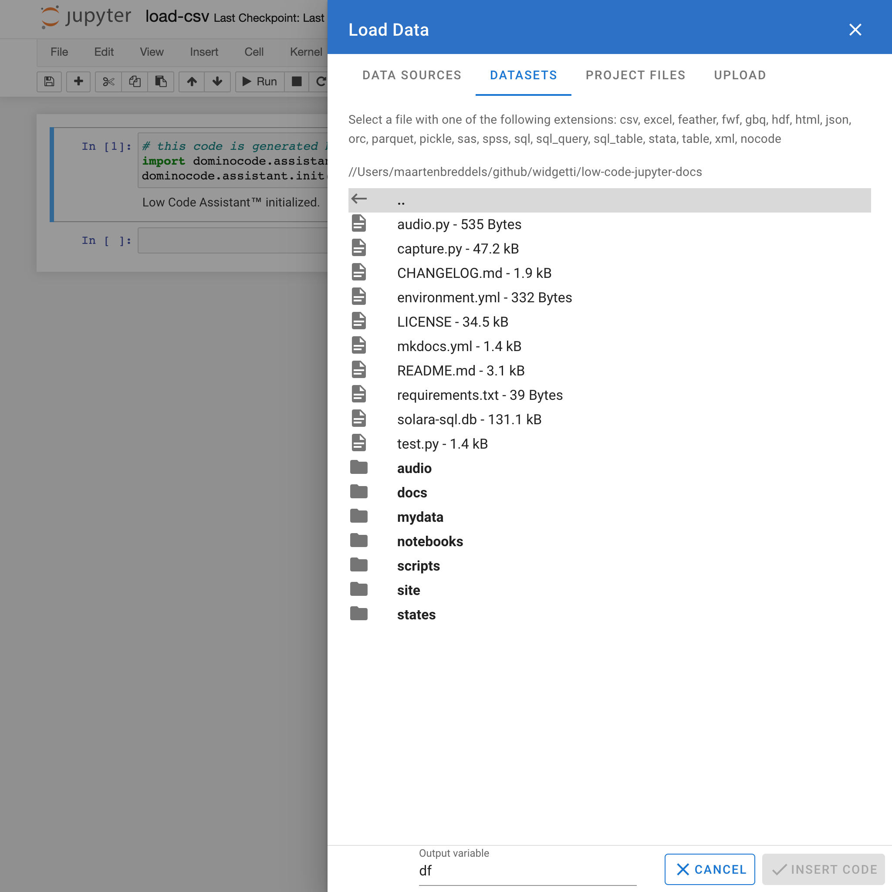
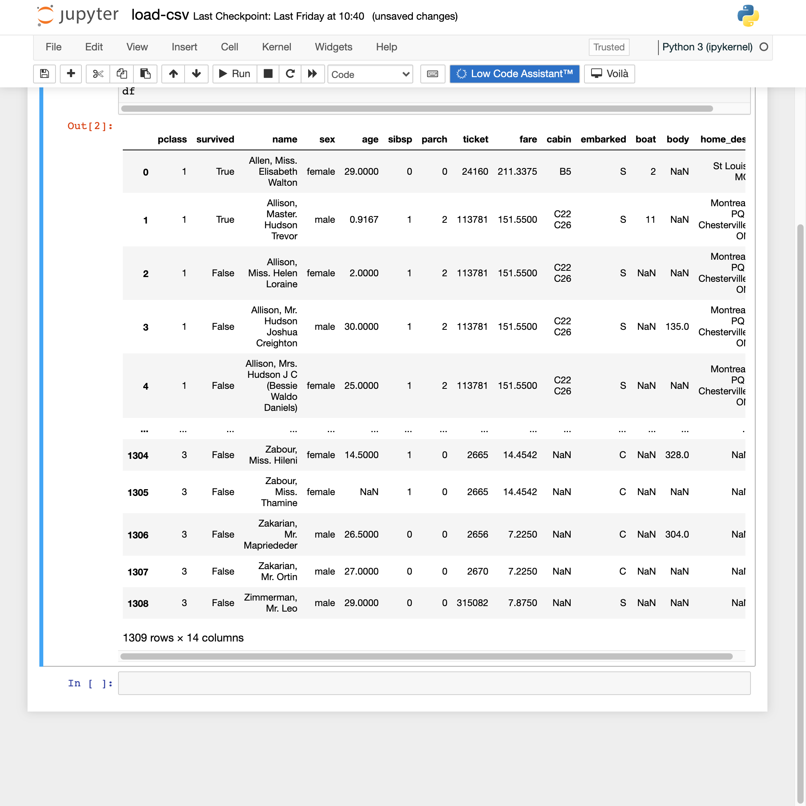

# Loading Data from CSV

The following video includes all the steps explained below

<video controls>
    <source src="https://user-images.githubusercontent.com/46192475/182823773-7af97491-89d4-44f3-9996-9b08900d38e1.mp4" type="video/mp4">
</video>

## Check installation

If you have followed the [installation instructions](../../install.md), you should see a blue Low Code Assistant™ button in the toolbar of your Jupyter notebook.

## Initialize the Low Code Assistant™

The Low Code Assistant™ can be started by clicking the Low Code Assistant™ button in the toolbar. It will insert a code snippet in a new code cell and execute it. After running succesfully, you should see `Low Code Assistant™ initialized`, as in the following screenshot:

If you now hover above a code cell, you should see a blue icon {.assistant-icon} to the right:

If you hover above the {.assistant-icon} icon, it will show a popup menu:

## Loading CSV data into a Pandas DataFrame

### Open dialog

Hover above the {.assistant-icon} icon and click the {.docs-border .menu-item} menu item, which will open the `Load Data` dialog.

### Select `Datasets` tab

To select a file, navigate to the `Datasets` tab:

### Navigate to the right directory

Use `..` to move a directory up:

And click the **bold** directory name to enter a directory

### Click to open

Click on the `titanic.csv` file, and it will close the dialog, and insert the Python code to load the `.csv` file
into a Pandas dataframe.

The dataframe will be assigned to the `df` variable. The last expression (the last line) of the code cell will only be the `df` variable, which will
cause the notebook to display its content.

You can now do your custom data transformations, by following the Pandas documentatio