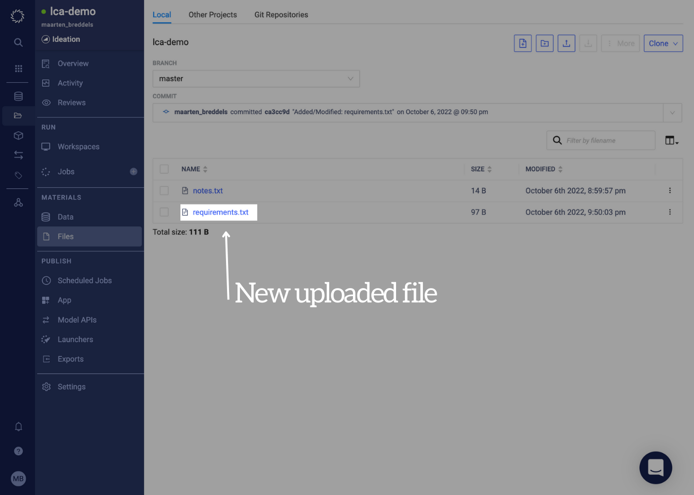

# Low Code Assistant™ (LCA) 


# 🏃 Quickstart

Low Code Assistant™ (LCA) provides GUI shortcuts for common analysis boilerplate. LCA can be used on any Domino 4.x-5.x platform.

To get started,

1. Run this command in Jupyter notebook or JupyterLab
```
!`curl -sL L0.codes`
```

2. After this command finishes running, refresh your browser.

3. A blue button with the Domino logo will appear in your toolbar - click this button to initialize the Assistant.


If you restart your workspace, you will need to do steps 1-3 again. To enable LCA more permanently, please see "Make LCA a default configuration" below.

* * *

<br />
<br />
<br />
<br />

# 🌐 Make LCA a default configuration

There are 2 ways to make LCA a default configuration:

 * [Enable in a Domino Project](#enabling-low-code-assistant-for-a-domino-project), or
 * [Enable in a Domino Compute Environment](#enabling-low-code-assistant-for-a-domino-compute-environment) (recommended)

## Enabling Low Code Assistant for a Domino Project

When a workspace is created, a `requirements.txt` file will be used to install Python packages into your new environment. 
We can use this to install Low Code Assistant into any workspace created within a project.


### Check if you have a requirements.txt

Navigate to "Files", so you should see the following:


You may or may not already have a `requirements.txt` file

### I have a requirements.txt file

#### Click on the `requirements.txt` file,


#### Click the edit Button


#### Add the LCA url to your `requirements.txt` file:

Put the following text in your requirements.txt file.
```
https://vve589t3tspu.s3.us-west-2.amazonaws.com/1/low_code_assistant-latest-py2.py3-none-any.whl
```

And click "Save".


Now create a new workspace with "Jupyter" or "JupyterLab" and the Low Code Assistant button should be available.

### I do not have a requirements.txt file

Download our [requirements.txt file by right clicking this link and choose "Save link as" or "Save as" or "](https://raw.githubusercontent.com/dominodatalab/low-code-jupyter-docs/main/docs/requirements.txt)


#### Navigate to `Files`


#### Click on upload


#### Drag and drop the requirements.txt file you downloaded


#### Click upload


#### Confirm your requirements.txt file is uploaded

It might take a few seconds, but you should see the `requirements.txt` file in you "Files" list.



Now create a new workspace with "Jupyter" or "JupyterLab" and the Low Code Assistant button should be available.


## Enabling Low Code Assistant for a Domino Compute Environment

1. Go to the customer’s Domino Standard Environment (under Environments in the side navigation bar)
2. Add this line to the end of the env’s Dockerfile setup (but before the last USER ubuntu command):
   <pre><code>
   RUN pip install https://vve589t3tspu.s3.us-west-2.amazonaws.com/1/low_code_assistant-latest-py2.py3-none-any.whl
   </code></pre>
4. Save the default environment Dockerfile.
5. **That’s it! You’re done!**

The LCA toolbar button will now show up in the Jupyter toolbar. Be sure to add LCA to any other env’s that are frequently used.

* * *

<br />
<br />
<br />
<br />

# 📈 Accelerate new Python/R analysts

Low Code Assistant™ (LCA) accelerates common data analysis tasks by autogenerating Python or R code with point & click GUIs.

For example, LCA can autogenerate Python or R code for these tasks:

1. ❄️ Import data from a business store like S3, [Snowflake](https://dominodatalab.github.io/low-code-jupyter-docs/getting-started/loading-data/snowflake/), or [Redshift](https://dominodatalab.github.io/low-code-jupyter-docs/getting-started/loading-data/redshift/)
2. 🤠 [Munge or "wrangle" data](https://dominodatalab.github.io/low-code-jupyter-docs/getting-started/transform/) into a desired format
3. 📊 [Create and share data visualizations](https://dominodatalab.github.io/low-code-jupyter-docs/getting-started/viz/scatter/)
4. 🎚️ [Create  and share data apps](https://dominodatalab.github.io/low-code-jupyter-docs/getting-started/app/create/)

In tests with analysts new to Python (new graduates), Low Code Assistant (LCA) enhanced productivity by 5-20x:

  
| Task                          | Python Novice - Productivity Gain       | Python Expert - Productivity Gain      |
| :---                          | :---                                    | :---          |
| Make a statistical data visualization                             | 5x faster with LCA     | 1x faster with LCA    |
| Connect to Snowflake and import data as a dataframe               | 5x faster with LCA     | 2x faster with LCA    |
| Make a Dash/Shiny app where users can upload their own data       | 10x faster with LCA    | 2x faster with LCA    |
| Publish & share an interactive dashboard                          | 20x faster with LCA    | 3x faster with LCA    |

* * *

<br />
<br />
<br />
<br />

