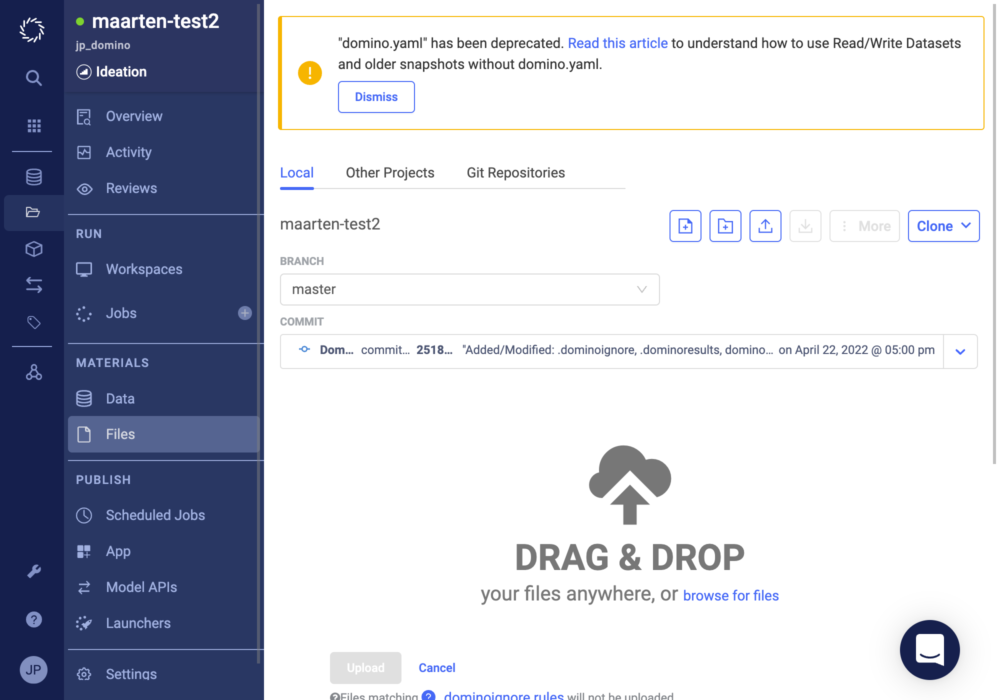
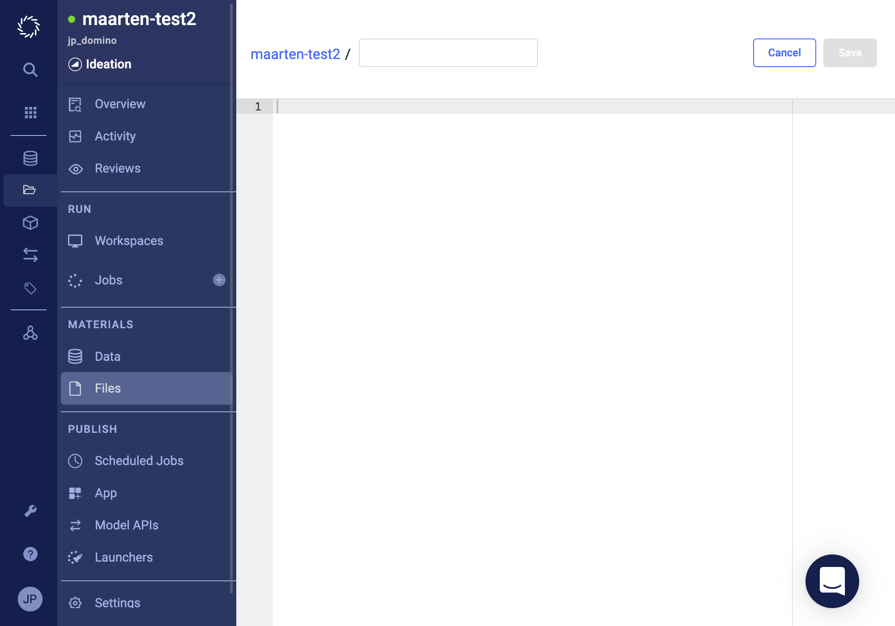
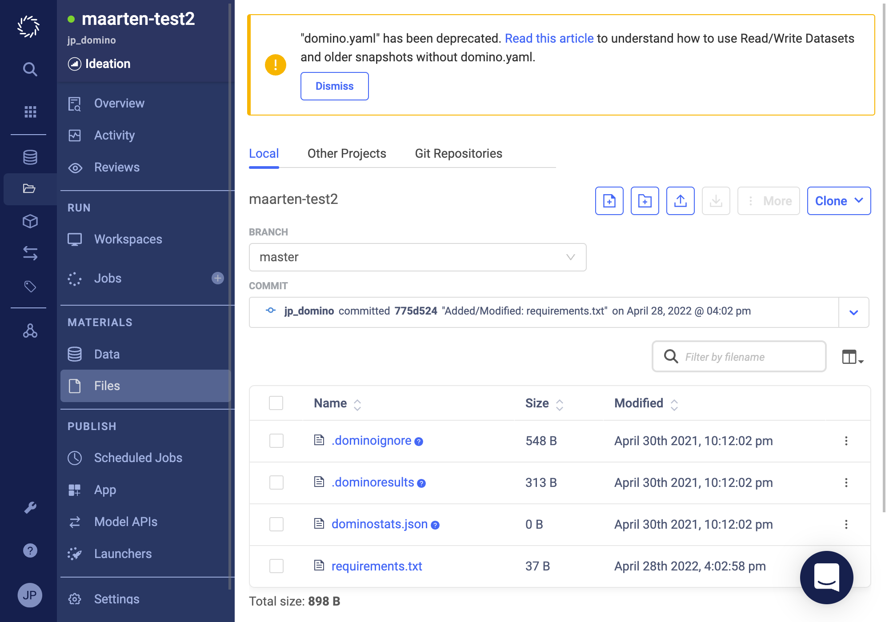

# Installation

Dominocode is not available from pypi, please contact us for a private link so you can install it.

!!! warning "JupyterLab not yet supported"

    Currently, the Low Code Assistant™ only works in the (classical) Jupyter notebook. JupyterLab is not yet supported.


## Manual installation
Once you have the private download link from your sales team, you can manually install it into an existing Python environment using.


<div class="termy">

```console
$ pip install https://private-url/dominocode.tar.gz

---> 100%
```

</div>

!!! info "From a notebook"

    You can also run this from your notebook, by running `!pip install ...` from a code cell.

!!! warning "Not persistent"

    If you install this into a running workspace, you might lose the installed package when the workspace restarts.
    It is best practice to install it as explained in the next section.

## Install for workspace

When a workspace is created, a `requirements.txt` file will be used to install Python packages into your new environment. 
We can use this to make sure dominocode is installed before we start our notebook.

### Navigate to `Files`

In your project, navigate to `Files`.




### Create a new file

Create a new file by clicking the left most :material-file-plus: icon to get to the following screen



### Give filename and enter url

Enter the `requirements.txt` filename in the top textfield and the private url in the bottom textarea.


### Save file

Clicking the `Save` button should give you the following screen, on success.


### Optional: check file

Navigate to `Files` again, to make sure you have added the file


