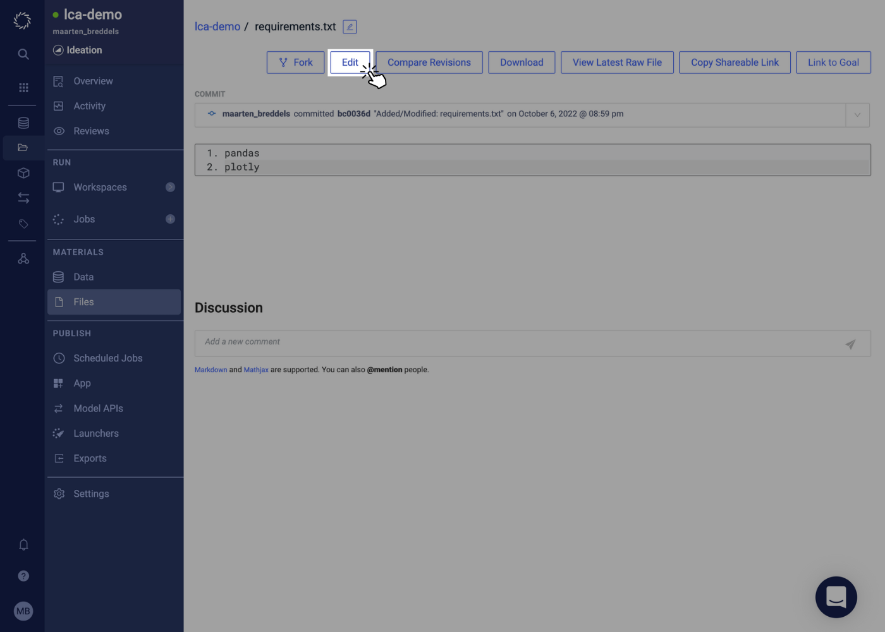

# Installation

## Enabling Low Code Assistant

The Low Code Assistant (LCA) can be used with either Python or R.

=== "Python"

      If you do not already have a _Jupyter_ or _JupyterLab_ workspace, then create on now. Launch the workspace.

      Run the following command in a notebook code cell:

      ```
      !pip install --user low-code-assistant
      ```

      

      After the installation completes, refresh your browser tab. The <span class="blue-button">Low Code Assistant</span> button will appear in the Jupyter toolbar. Click this button to initialize the assistant.

      

      To upgrade an existing version do:

      ```
      !pip install --user --upgrade low-code-assistant
      ```

=== "R"

      If you do not already have an _RStudio_ workspace, then create on now. Launch the workspace.

This is the easiest way to get started with LCA, but if you restart you workspace, you will need to reinstall Low Code Assistant again. To enable LCA more permanantly, [make it the default configuration](#make-lca-default-configuration).

## Make LCA the Default Configuration {#make-lca-default-configuration}

There are 2 ways to make LCA a default configuration:

 * [Enable in a Domino Project](#enable-lca-domino-project), or
 * [Enable in a Domino Compute Environment](#enable-lca-domino-compute-environment)

Enabling LCA in your organization's most used compute environments (CE) is the fastest way to deploy LCA. This way, LCA will appear automatically in any Jupyter or RStudio toolbar that is built from that CE. However, the CE will need to be rebuilt everytime there is an LCA update. If CE's are not rebuilt weekly, we recommend enabling LCA at the project-level.

## Enable LCA in a Domino Project {#enable-lca-domino-project}

When a workspace is created, a `requirements.txt` file will be used to install Python packages into your new environment. 
We can use this to install Low Code Assistant into any workspace created within a project.

### Check if you have a requirements.txt

Navigate to "Files", so you should see the following:


You may or may not already have a `requirements.txt` file

### I have a requirements.txt file

#### Click on the `requirements.txt` file,


#### Click the edit Button



#### Add the LCA url to your `requirements.txt` file:

Put the following text in your requirements.txt file.
```
https://vve589t3tspu.s3.us-west-2.amazonaws.com/1/low_code_assistant-latest-py2.py3-none-any.whl
```

And click "Save".


Now create a new workspace with "Jupyter" or "JupyterLab" and the Low Code Assistant button should be available.

### I do not have a requirements.txt file

Download our [requirements.txt file by right clicking this link and choose "Save link as" or "Save as" or "](https://raw.githubusercontent.com/dominodatalab/low-code-jupyter-docs/main/docs/requirements.txt)


#### Navigate to `Files`


#### Click on upload


#### Drag and drop the requirements.txt file you downloaded


#### Click upload


#### Confirm your requirements.txt file is uploaded

It might take a few seconds, but you should see the `requirements.txt` file in you "Files" list.


Now create a new workspace with "Jupyter" or "JupyterLab" and the Low Code Assistant button should be available.

## Enable LCA in a Domino Compute Environment {#enable-lca-domino-compute-environment}

1. Go to the customer’s Domino Standard Environment (under Environments in the side navigation bar)
2. Add this line to the end of the env’s Dockerfile setup (but before the last USER ubuntu command):
   <pre><code>
   RUN pip install https://vve589t3tspu.s3.us-west-2.amazonaws.com/1/low_code_assistant-latest-py2.py3-none-any.whl
   </code></pre>
4. Save the default environment Dockerfile.
5. **That’s it! You’re done!**

The LCA toolbar button will now show up in the Jupyter toolbar for your customer.
Be sure to add LCA to any other env’s that are frequently used by your customer.

## Rebuilding the Compute Environment

1. Go to the _Environments_ page (the cube icon in the left-side-bar).
2. Open your LCA environment definition.
3. Click the <span class="white-button">Edit Definition</span> button.
4. Scroll to the bottom and check :fontawesome-regular-square: _Full rebuild without cache_.
5. Click the <span class="white-button">Build</span> button.

## Check Versions

### Check Python Version

To check the version of Python in your environment, run the following:

```python
from platform import python_version

python_version()
```

## Check LCA Version

To check the version of LCA installed, run the following:

```python
import low_code_assistant

low_code_assistant.__version__
```

Follow [these instructions](#enabling-low-code-assistant-in-jupyter) to upgrade your LCA installation.